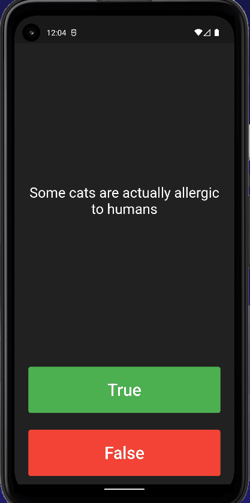

# Quizzly

A minimal quiz app made with Flutter as part of [Flutter Bootcamp](https://www.udemy.com/course/flutter-bootcamp-with-dart/) curriculum.

## Flutter and Dart concepts used

- Classes and objects
- Modularizing code
- OOP basics
- using third party packages

## Screenshots

